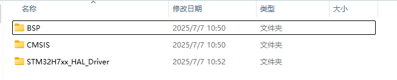
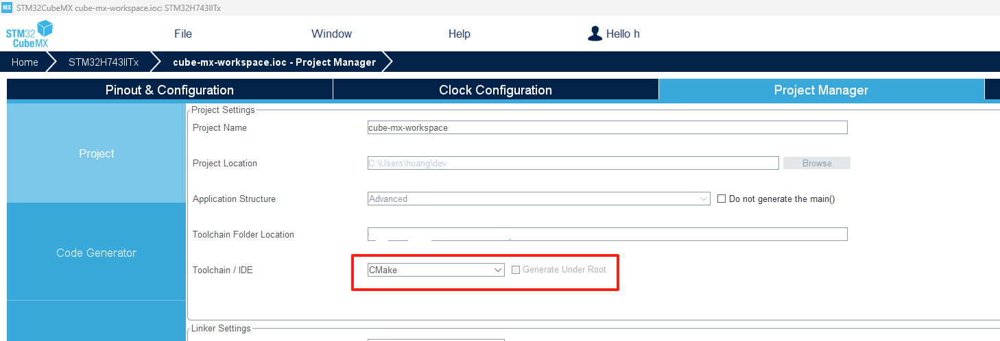
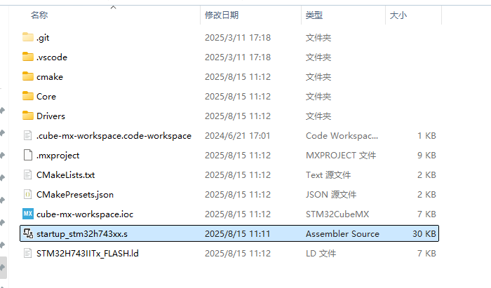
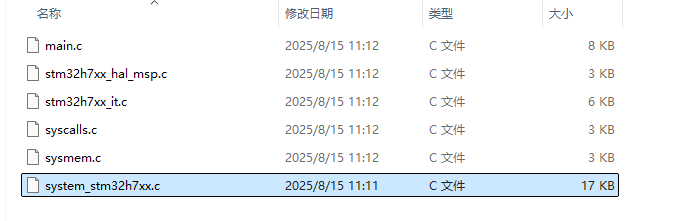
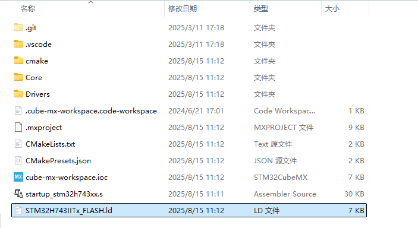

# libstm32h743-hal

为 stm32h743 导入 HAL 库。

# 导入过程

## 导入 STM32CubeH7 仓库源码

首先克隆 [STM32CubeH7](https://github.com/STMicroelectronics/STM32CubeH7.git) 仓库，克隆后打开它的目录


其中的 `Drivers` 目录中的内容就是 HAL 库。


进入 `Drivers` 目录



把 `CMSIS` 目录和 `STM32H7xx_HAL_Driver` 目录拷贝出来，放到本项目的 `src` 目录中，然后根据需要进行删减和目录结构的调整。

## 导入 stm32cubemx 生成的内容

1. system_stm32h7xx.c

从 github 中的 STM32CubeH7 仓库中导入的源码中只有 system_stm32h7xx.h, 没有 system_stm32h7xx.c, 需要从 stm32cubemx 生成的项目中导入。


2. 启动文件

虽然 STM32CubeH7 中也有一些启动文件，但是并不是所有型号的芯片都有。最好还是用 stm32cubemx 生成。




工具链选择 CMake, 准备好后生成项目。然后就可以在项目生成的路径下找到启动文件和 `system_stm32h7xx.c` .





此外还有一个链接脚本，可以拷贝到可执行文件项目中使用



因为本项目的目的是导入 HAL 库，所以不处理链接脚本。

# 通过 cmake 添加预定义宏

1. USE_HAL_DRIVER 是一定要定义的。
2. 因为是为 stm32h743iit6 导入 HAL 库，所以要定义 STM32H743xx.

```cmake
target_compile_definitions(
	${ProjectName} PUBLIC
	USE_HAL_DRIVER=1
	STM32H743xx=1
)
```

在预编译、安装本库后，使用本库的地方也要预定义这两个宏。